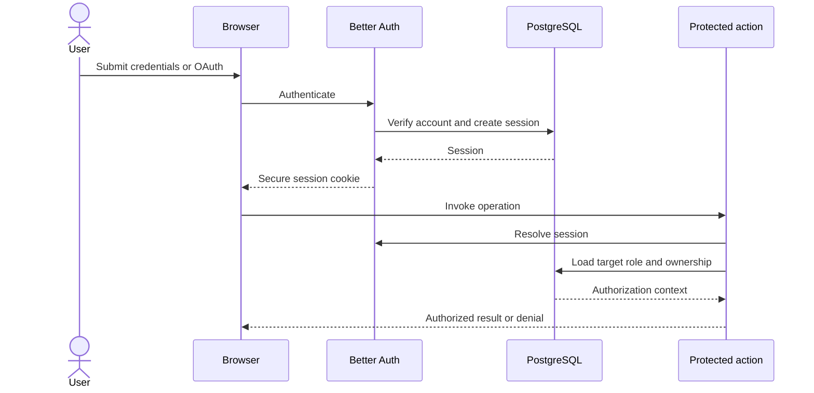

# Authentication and Account Security

## Authentication design

CNERSH uses Better Auth for password and Google OAuth sign-in. Server actions and API routes resolve the current session independently and do not rely on client role claims.



## Account controls

- Better Auth secrets and trusted origins are required.
- Passwords require at least ten characters.
- Email verification is enabled.
- Authentication responses use `Cache-Control: no-store`.
- Login and signup endpoints use shared production rate limits.
- Banned users and target roles are checked before protected actions.
- Role changes use server-side hierarchy checks rather than generic client mutations.

## Role rules

- Users manage their own profile and resources.
- Administrators manage ordinary users and operational workflows.
- Administrators cannot manage administrators or superadministrators.
- Administrators cannot assign elevated roles.
- Superadministrators may manage lower-role accounts.
- No actor may manage a peer superadministrator.

## Environment

```env
BETTER_AUTH_URL="https://your-domain.com"
BETTER_AUTH_SECRET="a-random-secret-at-least-32-characters"
BETTER_AUTH_TRUSTED_ORIGINS="https://your-domain.com"
GOOGLE_CLIENT_ID="..."
GOOGLE_CLIENT_SECRET="..."
REDIS_URL="redis://..."
```

Update the base URL, trusted origins, and Google OAuth callback URL together when configuring a custom domain.
