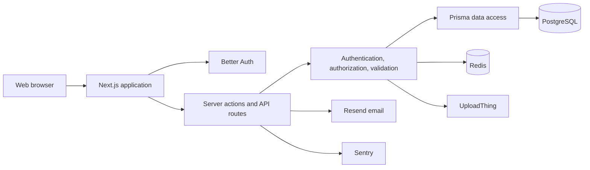

# CNERSH Web Application

CNERSH is a secure workflow platform for submitting, reviewing, deciding, and monitoring health research ethics protocols in Cameroon. It combines applicant self-service, reviewer conflict-of-interest screening and evaluation, committee administration, appeals, adverse-event reporting, community features, notifications, and a complete audit trail.

## Product capabilities

- **Applicants:** Create and autosave an 18-step protocol, upload supporting documents, submit, track decisions, appeal eligible decisions, and report serious adverse events.
- **Reviewers:** Declare conflicts of interest, access only assigned protocols, save evaluation drafts, and submit seven-criterion evaluation reports.
- **Administrators:** Assign eligible reviewers, manage committee sessions, moderate restricted community content, review protocols, and inspect audit records.
- **Super administrators:** Manage privileged accounts under a strict role hierarchy.
- **Public users:** Read institutional information, policies, terms, resources, and approved public feed content.

## System overview



See the detailed [architecture and UML documentation](docs/ARCHITECTURE.md), [security controls](SECURITY_IMPROVEMENTS.md), [design system](docs/DESIGN_SYSTEM.md), and [deployment runbook](docs/DEPLOYMENT.md).

## Technology

| Layer | Technology |
|---|---|
| Application | Next.js 16 App Router, React 19, TypeScript |
| Authentication | Better Auth, Google OAuth |
| Data | PostgreSQL, Prisma ORM, Prisma PostgreSQL adapter |
| Shared state | Redis for rate limits and idempotency |
| Interface | Tailwind CSS 4, shadcn/ui, Base UI, Radix UI |
| Files | UploadThing with application-level authorization |
| Email | Resend and React Email |
| Monitoring | Sentry |
| Testing | Jest, Testing Library, Playwright |

## Local development

### Requirements

- Node.js 22.22.2 or newer
- PostgreSQL
- Redis
- UploadThing v6 server credentials

### Installation

```bash
git clone https://github.com/kenrique100/cnersh-webapp.git
cd cnersh-webapp
npm install
cp .env.example .env
```

Fill in `.env` using the descriptions in [.env.example](.env.example). Important production requirements include:

```env
DATABASE_URL="postgresql://..."
DIRECT_URL="postgresql://..."
BETTER_AUTH_URL="http://localhost:3000"
BETTER_AUTH_SECRET="a-random-secret-at-least-32-characters"
BETTER_AUTH_TRUSTED_ORIGINS="http://localhost:3000"
GOOGLE_CLIENT_ID="..."
GOOGLE_CLIENT_SECRET="..."
UPLOADTHING_SECRET="sk_..."
REDIS_URL="redis://..."
CRON_SECRET="a-random-cron-secret"
NEXT_PUBLIC_APP_URL="http://localhost:3000"
```

Never commit real credentials. Production must not start without shared Redis, and UploadThing v6 requires `UPLOADTHING_SECRET` beginning with `sk_`.

### Database

For local development:

```bash
npm run db:migrate:dev
npm run db:seed
```

For production:

```bash
npm run db:migrate
```

Before applying migration `20260909223000_unique_committee_session_schedule`, resolve existing duplicate committee sessions that share a `sessionType` and `sessionDate`:

```bash
npm run db:dedupe:sessions          # read-only report and merge plan
npm run db:dedupe:sessions:apply    # merge duplicate groups that carry no conflicting data
```

Apply mode backs up removed rows to `backups/`, runs in one transaction, and leaves any group whose duplicates disagree on committee data for manual resolution. See [DEPLOYMENT.md](DEPLOYMENT.md).

### Run and verify

```bash
npm run dev
npm test -- --runInBand
npm run lint
npm run build
```

Open [http://localhost:3000](http://localhost:3000).

## Scripts

| Command | Purpose |
|---|---|
| `npm run dev` | Start the development server |
| `npm run build` | Generate Prisma Client and create a production build |
| `npm run start` | Start the production server |
| `npm test` | Run Jest tests |
| `npm run test:coverage` | Run Jest with coverage |
| `npm run lint` | Run ESLint |
| `npm run db:generate` | Generate Prisma Client |
| `npm run db:migrate:dev` | Create and apply development migrations |
| `npm run db:migrate` | Apply committed migrations |
| `npm run db:seed` | Seed administrator accounts |
| `npm run db:dedupe:sessions` | Report duplicate committee sessions before the uniqueness migration |
| `npm run db:dedupe:sessions:apply` | Merge non-conflicting duplicate committee sessions |
| `npm run db:studio` | Open Prisma Studio |
| `npm run db:reset` | Drop the local database, replay every migration, then seed |
| `npm run db:reset:push` | Force schema push without migrations (escape hatch; bypasses the migration history) |

## Security model

- Protected server actions and routes authenticate at the execution boundary.
- Object-level policies enforce owner, assigned reviewer, administrator, and superadministrator access.
- Administrators cannot grant elevated roles or manage peers; only a superadministrator can manage lower privileged accounts.
- Protected file responses use `private, no-store`; direct storage access should also be private or short lived.
- Outbound link previews pin validated public DNS addresses to prevent DNS rebinding.
- Redis-backed rate limits and idempotency are shared and atomic in production.
- Multi-record workflow changes use database transactions and conditional state transitions.
- Every document response carries a per-request Content Security Policy nonce issued by `src/proxy.ts`; scripts are restricted to that nonce plus `'strict-dynamic'`, with no `'unsafe-inline'` in production.

### Content Security Policy

The script policy must name a per-request nonce. The App Router streams its
hydration payload through inline `<script>` tags, so a static `script-src 'self'`
blocks them, React never hydrates, and every client component stops working -
including forms, which then fall back to native browser submission and can place
submitted values in the URL.

Because of that:

- `src/proxy.ts` mints the nonce and sets the document policy. `src/lib/csp.ts` builds the policy so there is a single definition.
- `next.config.ts` must not also set a `Content-Security-Policy` on documents. When two policies are present the browser enforces both, and a static one would reject the nonced scripts.
- Anything that needs an inline script must receive the nonce (`x-nonce` request header, as the root layout does for the theme script) or be moved to a real file under `public/`.
- `src/lib/__tests__/csp.test.ts` guards these properties.

Report vulnerabilities privately according to [SECURITY.md](SECURITY.md). Do not open a public vulnerability issue.

## Deployment

Use the [deployment runbook](docs/DEPLOYMENT.md). The minimum release gate is:

1. Configure Node.js 22.22.2 or newer and every required environment variable.
2. Back up the production database.
3. Resolve committee-session duplicates and apply migrations.
4. Run tests, lint, type checking, the dependency audit, and the production build.
5. Verify protected file headers, cron authentication, Redis connectivity, OAuth callbacks, and upload cleanup.
6. Configure the custom domain and update `BETTER_AUTH_URL`, trusted origins, OAuth callback URLs, and `NEXT_PUBLIC_APP_URL`.
