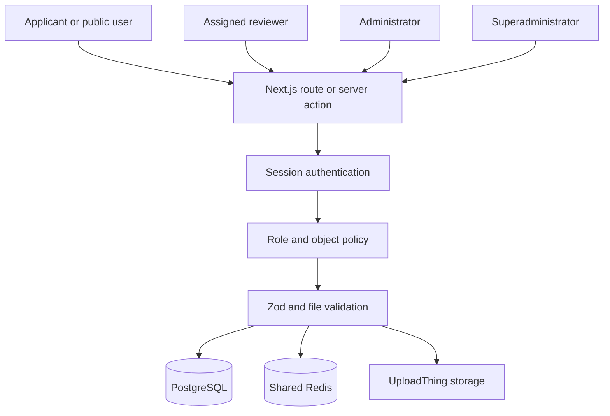
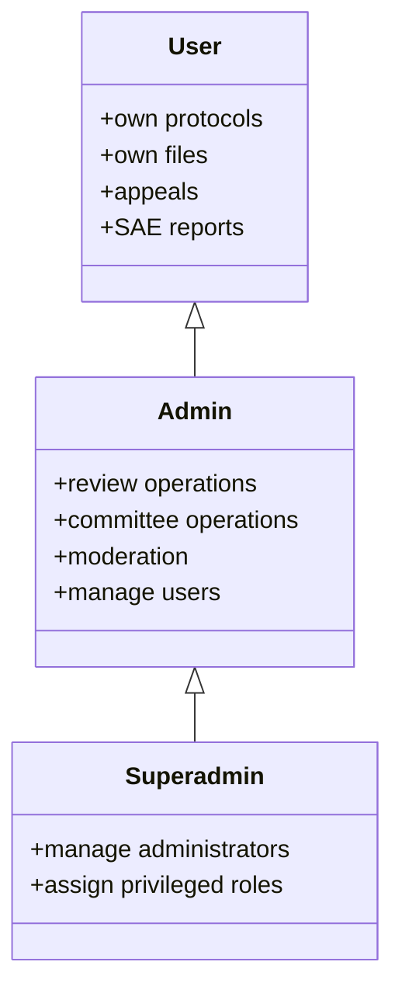
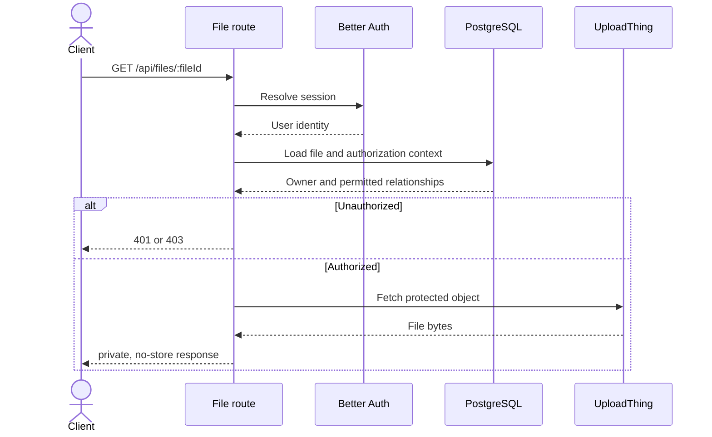

# Security Architecture and Remediation

This document describes the security controls implemented after the application security, authorization, and workflow review.

## Trust boundaries

Every protected operation must pass authentication, target-aware authorization, and input validation. Page-level redirects are usability controls only and are never treated as authorization.

## Role hierarchy

- An administrator may manage ordinary users only.
- An administrator cannot grant administrator or superadministrator.
- A superadministrator may manage lower roles but not a peer superadministrator.
- Role assignment and target management are separate policy decisions.

## Implemented controls

### Files and uploads

- File reads, view redirects, and deletion require a valid session and object-level access.
- Storage keys are resolved through database ownership records rather than accepted as standalone authority.
- Protected responses use `Cache-Control: private, no-store`.
- Upload idempotency keys are scoped to the authenticated user and request payload.
- Upload validation covers size, MIME type, content signature, filename safety, PDF limits, and basic malware indicators.
- A failed database write triggers best-effort deletion of the newly uploaded object.

### Server-side requests

- Link previews accept only HTTP and HTTPS.
- Private, loopback, link-local, reserved, multicast, documentation, and metadata address ranges are blocked.
- DNS is resolved once, every result is validated, and the connection is pinned to an approved address.
- Redirects are revalidated and response size and time are bounded.

### Rate limiting and idempotency

- Production requires shared Redis.
- Sliding-window rate limits use an atomic Lua operation and Redis server time.
- Authentication and resource-intensive endpoints fail closed when the shared limiter is unavailable.
- Idempotency locks are payload-bound and safely released.

### Workflow integrity

- Protocol, reviewer, COI, evaluation, appeal, committee session, AAR, and SAE inputs use strict schemas.
- State changes use legal transition matrices and conditional source-state predicates.
- Related writes, notifications, status history, and audit events are transactional.
- Reviewer assignment uses serializable transactions and in-transaction availability checks.
- Committee sessions have a unique `sessionType` and `sessionDate` constraint.
- Poll voting and other contested writes use atomic database operations.

### Operational endpoints

- Cron calls require `CRON_SECRET` and fail closed when it is missing.
- Health and readiness endpoints return generic public errors and log internal details.
- Authentication and protected file responses are not publicly cached.
- Security headers include CSP, HSTS, frame denial, MIME sniffing prevention, a restrictive permissions policy, and strict referrer handling.

## Protected file sequence

## Remaining operational safeguards

- Configure UploadThing objects as private or issue short-lived signed URLs at the provider layer.
- Add a durable retry or reconciliation job for failed compensating deletion.
- Monitor Redis availability, rate-limit denials, authentication failures, file access denials, and cron failures.
- Rotate secrets immediately if they are ever exposed.
- Review role and audit-log records on a defined schedule.

## Verification baseline

The remediation baseline passed 105 Jest suites with 1,686 tests, TypeScript checking, Prisma validation, a Node 22 production build, `git diff --check`, and an npm audit with zero reported vulnerabilities.
