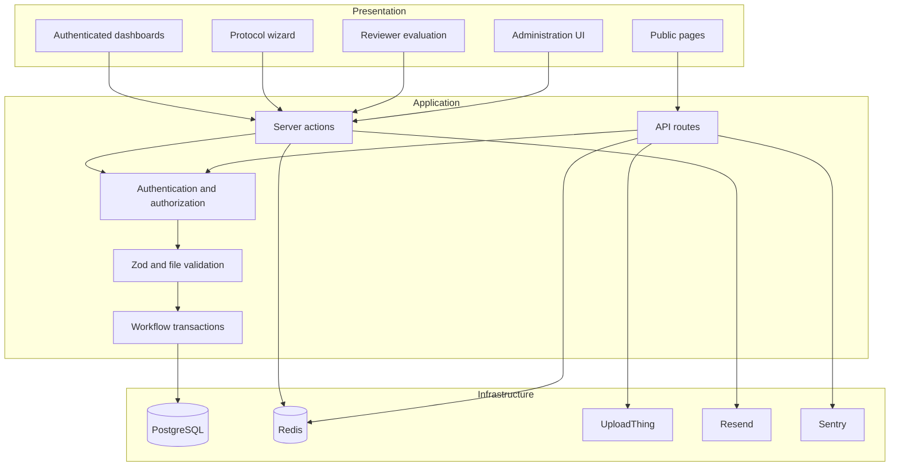
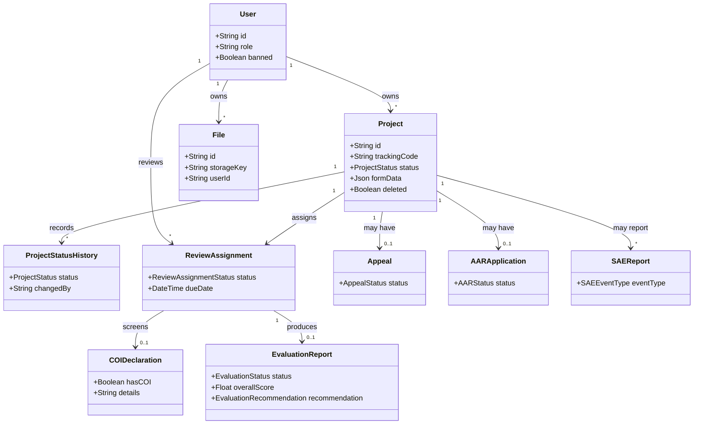
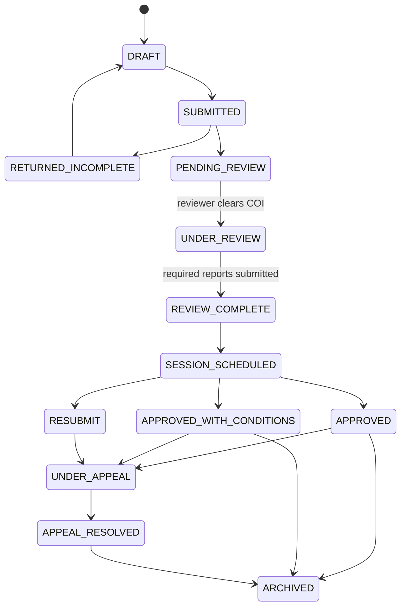
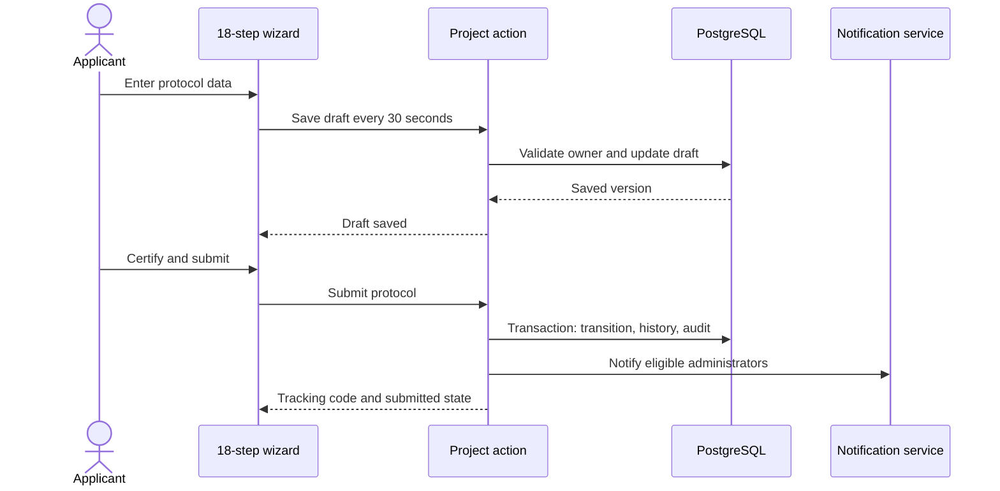
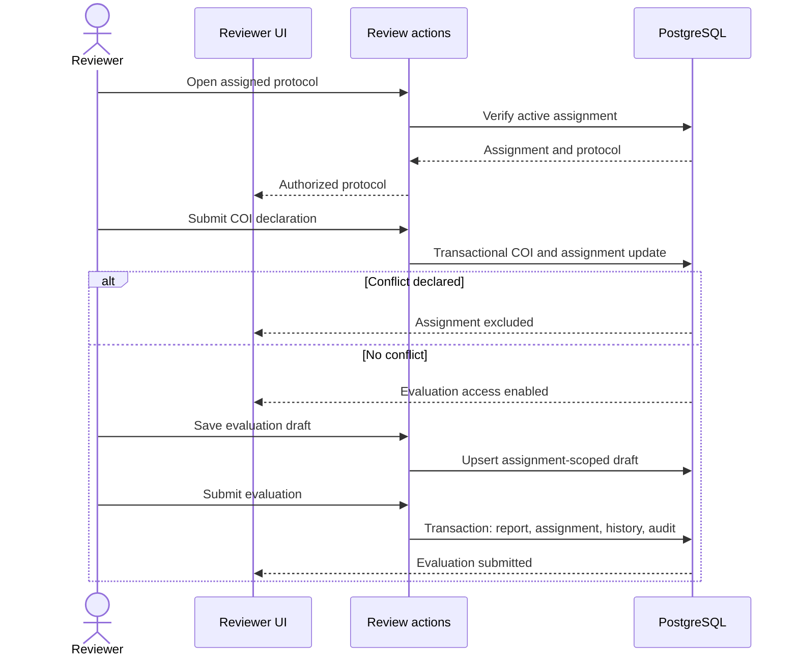

# Architecture and UML

## Application structure

CNERSH uses the Next.js App Router. Server components assemble pages, client components handle interactive forms, server actions implement domain mutations, API routes handle HTTP integrations, and Prisma provides typed PostgreSQL access.

## Domain model

The diagram shows the primary protocol-review relationships. Community and feed entities are omitted for readability.

## Protocol lifecycle

Backend transition matrices are authoritative. UI controls may suggest an action, but the server validates the current state again inside the write.

## Submission sequence

## Reviewer sequence

## Repository map

| Path | Responsibility |
|---|---|
| `src/app/(auth)` | Authentication pages |
| `src/app/(dashboard)` | Authenticated applicant, reviewer, and administrator pages |
| `src/app/actions` | Domain reads and mutations |
| `src/app/api` | HTTP APIs and integrations |
| `src/components` | Shared and feature UI |
| `src/lib` | Authentication, policies, validation, rate limiting, SSRF defense, and infrastructure |
| `src/emails` | Transactional email templates |
| `prisma/schema.prisma` | Data model |
| `prisma/migrations` | Production database migrations |

