# Deployment Runbook

## Required platform configuration

- Node.js 22.22.2 or newer
- PostgreSQL with pooled `DATABASE_URL` and migration-safe `DIRECT_URL`
- Shared Redis through `REDIS_URL`
- Better Auth base URL, secret, trusted origins, and Google OAuth credentials
- UploadThing v6 `UPLOADTHING_SECRET` beginning with `sk_`
- Resend credentials and sender identity
- Sentry project configuration
- A strong `CRON_SECRET`

Use `.env.example` as the canonical variable list.

## Release flow

```mermaid
flowchart LR
    PR[Pull request] --> CI[Tests, lint, type check, audit]
    CI --> Backup[Database backup]
    Backup --> Preflight[Duplicate-session preflight]
    Preflight --> Migrate[Prisma migrate deploy]
    Migrate --> Build[Next.js production build]
    Build --> Deploy[Deploy application]
    Deploy --> Smoke[Security and workflow smoke tests]
    Smoke --> Monitor[Monitor logs and Sentry]
```



## Pre-deployment checks

```bash
npm ci
npx prisma validate
npx tsc --noEmit
npm test -- --runInBand
npm run lint
npm audit
npm run build
```

Before migration `20260909223000_unique_committee_session_schedule`, resolve duplicate committee sessions sharing a `sessionType` and `sessionDate`; the unique index cannot be created while duplicates exist.

```bash
npm run db:dedupe:sessions          # read-only report and plan
npm run db:dedupe:sessions:apply    # merge non-conflicting duplicate groups
```

Because `CommitteeSession` has no dependent relations, collapsing a group cannot orphan records. The script merges agenda entries as a union, carries over any field present on only one row, backs up deleted rows to `backups/`, and leaves groups with conflicting committee data untouched for manual resolution. Exit code `2` means duplicates still need a human decision. See `DEPLOYMENT.md` for the full procedure.

## Migration and deployment

```bash
npm run db:migrate
npm run build
npm run start
```

Do not use `prisma db push --accept-data-loss` against production.

## Security smoke tests

- Anonymous file read, file view, and file deletion return an authentication error.
- A signed-in user cannot access another user’s file.
- Protected file responses contain `Cache-Control: private, no-store`.
- An administrator cannot grant administrator or superadministrator roles.
- A regular user cannot invoke community server actions.
- Link preview rejects localhost, private networks, metadata addresses, and rebinding attempts.
- Authentication and upload limits fail closed if Redis is unavailable.
- Cron requests without the correct bearer secret are rejected.
- Health endpoints do not expose raw infrastructure errors.

## Workflow smoke tests

- A draft protocol can restore, autosave, pass completeness checks, and submit once.
- A reviewer with a conflict is excluded and loses protocol access.
- An active reviewer can save and submit one assignment-scoped evaluation.
- Protocol transitions outside the legal state matrix are rejected.
- Review completion requires the configured number of submitted evaluations.
- Committee session creation is safe under retry.
- Appeals enforce eligibility and time windows.
- SAE dates cannot be in the future.

## Custom domain

After adding the domain in the hosting provider and configuring DNS:

1. Set `BETTER_AUTH_URL` and `NEXT_PUBLIC_APP_URL` to the HTTPS domain.
2. Add the domain to `BETTER_AUTH_TRUSTED_ORIGINS`.
3. Update Google OAuth callback URLs.
4. Confirm HSTS, CSP, cookies, redirects, email links, uploads, and Sentry on the final domain.

## Rollback

1. Stop new writes if data integrity is at risk.
2. Roll back the application to the previous known-good release.
3. Prefer a forward database migration over destructive down migrations.
4. Restore from backup only when forward repair is unsafe.
5. Preserve logs and audit records for incident review.

