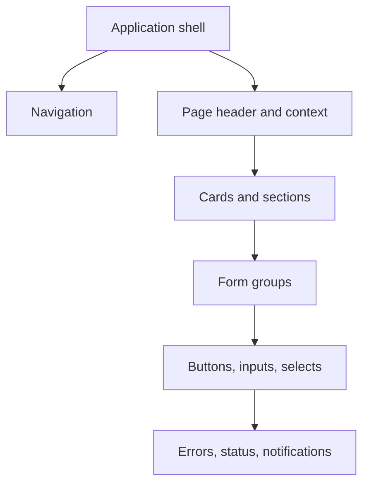

# Interface Design System

## Direction

The interface uses an institutional, accessible visual language appropriate for a national research ethics committee. The design favors clarity, evidence, and predictable workflows over decorative effects.

## Principles

- Use solid institutional blue for primary actions and identity.
- Use neutral surfaces and borders to separate information.
- Keep border radii moderate and consistent.
- Prefer descriptive labels such as “Study Review Form” over vague terms such as “Reviews”.
- Use Lucide icons only when they improve scanning; do not use emoji as interface icons.
- Avoid gradients, fake statistics, invented testimonials, decorative AI imagery, cursor effects, and broad scroll animation.
- Respect reduced-motion preferences.

## Color tokens

The source of truth is `src/app/globals.css`.

| Purpose | Token | Usage |
|---|---|---|
| Page background | `--background` | Application canvas |
| Text | `--foreground` | Primary copy |
| Primary | `--primary` | Main actions and selected states |
| Secondary | `--secondary` | Supporting controls |
| Muted | `--muted` | Quiet surfaces |
| Destructive | `--destructive` | Dangerous operations |
| Border | `--border` | Cards, fields, and separators |
| Focus | `--ring` | Keyboard focus |

## Component hierarchy

## Form behavior

- Every input has a visible label.
- Required fields are identified in text, not color alone.
- Validation messages appear near the field and are summarized before final submission.
- Draft state is explicit and autosave never replaces manual save.
- Destructive and irreversible actions require clear wording and server validation.
- Focus indicators must remain visible.

## Responsive behavior

- Mobile layout starts at 375 CSS pixels without horizontal overflow.
- Dense multi-column forms collapse to one column.
- Navigation uses a mobile menu rather than shrinking desktop controls.
- Sticky controls must not cover form content or validation messages.
- Tables provide responsive alternatives where necessary.

## Accessibility baseline

- Semantic headings follow a logical order.
- Interactive elements are keyboard reachable.
- Color contrast targets WCAG AA.
- Motion is minimal and disabled through `prefers-reduced-motion`.
- Icon-only controls require accessible names.
- Status is communicated with text in addition to color.

